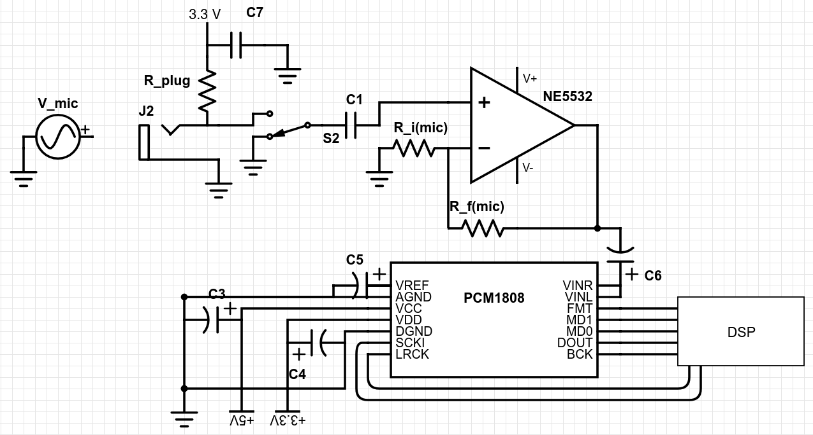
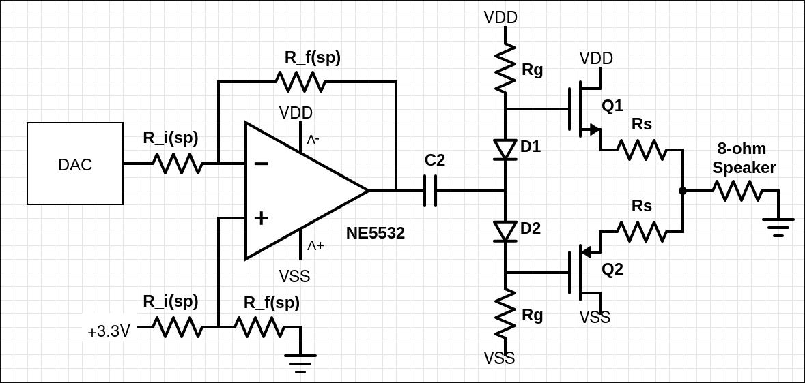

# hardware-autotune

I'm re-creating the autotune effect using digital circuits. When complete, I plan to have a device that can connect to a microphone, and includes an onboard speaker with the option to connect a separate speaker instead. The user will speak into the microphone, the circuit I made with HDL is gonna apply autotune, and then the result will playback on the speaker.

## Analog Circuit Design

This section will cover the design of the recording and playback analog circuits. I specifically left component values unknown as I they depend on certain specifications that I haven't decided yet.

For info on the digital implementations of autotune and other effects, see the following links:

- WIP

### Recording

Above is the circuit diagram detailing how microphone input will be processed before reaching the ADC, and then the DSP. Assume all connections to the DSP have $100 \omega$ resistors.

1. We start at the voltage source labelled $V_{mic}$, this represents the microphone which converts your voice into an AC waveform with a very small amplitude. Microphones typically require a small amount of plug in power, so we connect the microphone to our $3.3 V$ source, with a resistor to limit current, and a capacitor to shunt noise to GND. J1 is a headphones jack that will close this circuit.
2. Switch $S_1$ acts as an on/off switch for accepting microphone input. When in the downwards OFF position, the ADC should receive a constant $0 V$. In the upwards ON position, it should allow our microphone signal to pass to the next stage.
3. Because the DC plug in power is on the same line as the AC output, we place a capacitor $C_2$ to recenter our AC waveform at $0 V$. 
4. Here we pass our microphone signal through a non-inverting amplifier circuit to get it to the ADC's desired amplitude.
5. Now, our signal is ready to pass through the ADC and be processed by the DSP. The ADC was wired up according to the [datasheet](docs/pcm1808.pdf) under the section "Application and Implementation".

### Playback

Above is the circuit diagram detailing how our DSP's digital output will be processed in order to be played on analog speakers. Assume all connections to the DSP have $100 \omega$ resistors.

1. The DSP feeds digital input data representing our audio into the DAC, which converts it into an analog waveform. I specifically left $H_{out}R$ disconnected because we're dealing with mono sound. The DAC was wired up according to the [datasheet](docs/sles011e.pdf) under the section "Application Information".
2. At the DAC output, our signal is going to be $1.24 V_{pp}$ centered at $0.62 V$, we send our signal through a capacitor to recenter it at $0 V$. Also, we use an RC high-pass filter to attenuate the high frequency switching noise.
4. The signal reaches a junction where the top amplifier brings it to the amplitude required to be played on the onboard speaker, while the bottom one is simply there to prevent the headphones from altering the cutoff frequency of the preceeding high-pass filter. However, I chose a different amplifier due to increased current requirements.
5. While our signal has the amplitude required, it lacks the current needed to produce loud and rich audio. We use two source follower amplifiers, one for the positive half-cycle, and one for the negative. The diodes bias these transistors so that they are held at the edge of saturation, which is required to prevent crossover distortion. I specifically chose source follower amplifiers because the gain is unity, keeping our signal at the amplitude we like.
6. Now our audio signal is ready to be played on the speaker. Speakers can be modelled by an $8 \Omega$ impedance, showcasing their high current demands. This speaker will be onboard.

Component Values:

- Amplifier supply: $+5 V$ and $-5 V$
- $R_{i(sp)}$: $3.3 k\Omega$
- $R_{f(sp)}$: $10 k\Omega$
- $V_{DD}$: $+5 V$
- $V_{SS}$: $-5 V$
- $C_1$: $10 \mu\text{F}$ Aluminum Electrolytic
- $C_2$: $10 \mu\text{F}$ Aluminum Electrolytic
- $R_b$: $10 k\Omega$
- $C_3$: $100 nF$ Ceramic
- $R_g$: $100 \Omega$
- $R_s$: $0.47 \Omega$, $1 W$

Important: 

- $C_3$ MUST be placed as close as humanly possible to the $V_{cc}$ and $V_{HP}$ pins. Yes that means two capacitors. Same goes for $C_1$.
- Both $R_g$ MUST be placed as close to the gate of the respective MOSFET as possible.

## Components

TBD

## Plans for future

**May 26, 2026:** I'm considering adding more effects than just autotune, and enabling profile creation too. My friend also gave me a pretty good idea of printing this using TinyTapeout, it'd be sick to have my very own ASIC that I designed all on my own. 

**May 27, 2026:** I feel like its useful for a project like this to have options for input/output. My plan is to use a 3.5mm audio jack for the mic input, and another 3.5mm audio jack directly after the DAC so that active speakers (like the ones in headphones) can hear the audio. The onboard 8-ohm passive speaker will still be there as it gives me a reason to design my own audio amp.
